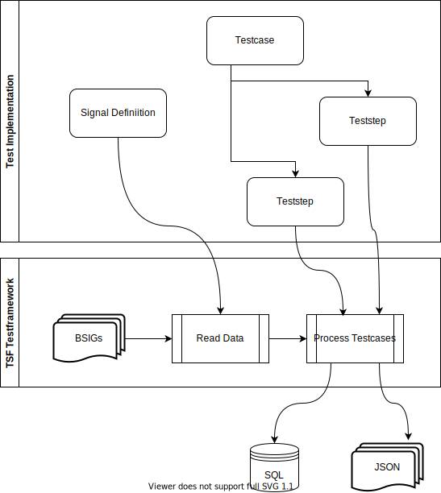

Quickstart
==========

Prerequisites
-------------
You'll need to know a bit of Python. To work the examples you need install a :doc:`venv <../setup/setup>` with adas-tsf and its dependencies
installed.

Learner profile
^^^^^^^^^^^^^^^

This is a quick overview of test implementation and processing with the TSF library. You should be familiar with
pandas Dataframes and software testing.

Learning Objectives
^^^^^^^^^^^^^^^^^^^

After reading, you should be able to:

- What a test case and test step is.
- Know how to map signals
- Know how to setup the runner

Test scripting with TSF
-----------------------

TSF provides a framework to support test implementation and processing for KPIs.
The main purpose is the processing of Simulation outputs (e.g. HIL, SIL, VSP) and evaluating the
output signals on certain behaviors.
The number of processed outputs can vary from one up to many thousand.

The outputs are processed in batch without depending on each other in either input order or implementation order.
With that it is possible to develop and test the test-script implementation on a single input, as shown in this
quickstart.

Let's assume we have some SIL Outputs of an EBA CCRs use-case.

Use-case parameters:

- Approach ego velocity: 50 km/h
- Target Overlap: 100%
- Target rotation: 0°

Evaluation Scope:

- Assert that the EBA function outputs a pre-brake deceleration signal.
- Assert the reaction is early than 1.1 s TTC

Have a look at parts which interact during the evaluation.
First the TSF will open the relevant inputs, the signals which need to be read are defined in the signal definition.
After all signals are read, the test step are processed. For each input of each test-step a result has to be computed.
Additionally, you may want to add more informal data and statistics which should be reported later on.

      Overview on test scripting an processing TSF.

Setting up Testcases and Teststeps
----------------------------------

Lets start with implementing a testcase. Test-cases define the inputs which are valid for the given test-case and
its test-steps. The test case verdict is computed from the verdicts of its test steps. If one or more test-steps are
failed the entire testcase will be marked as failed.

.. literalinclude:: ../../src/examples/quickstart/main.py
    :linenos:
    :pyobject: ExampleUsecaseTestCase
    :language: python

Test-step will be used to compute result for the read data. You need to define the needed signals by providing a signal
definition. The dataframe returned from the readers includes a column 'ts' which represents the timestamp in micro seconds.

.. literalinclude:: ../../src/examples/quickstart/main.py
    :linenos:
    :pyobject: ExampleTestStep
    :language: python

A signal definition defines the mapping between the signal name from the input and the column in the read dataframe.
The read signals are provided to the test steps as a dataframe by it alias.

.. literalinclude:: ../../utilities/signal_definitions.py
    :linenos:
    :pyobject: ExampleSignals
    :language: python

Debugging the test implementation
---------------------------------

During the development phase it is useful to run a single testcase with a single input without any complex setup.
This can be accomplished by calling the test case with :code:`debug(..)`.

Debugging for the implementation above would look like:

.. literalinclude:: ../../src/examples/quickstart/main.py
    :linenos:
    :pyobject: main
    :language: python

View and download the full source code from `the TSF examples repository <https://github-am.geo.conti.de/ADAS-Test-Scripting-Foundation/examples/quickstart/main.py>`_.

