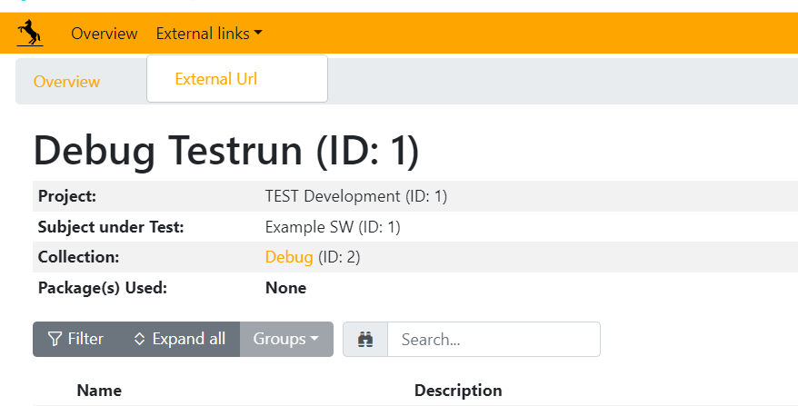
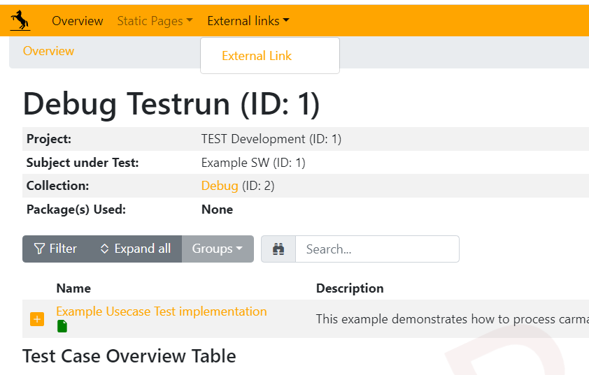

.. _TSF External Link:

TSF Report - External Links
===========================

Test Scripting Foundation (TSF) supports customizing the report by linking to an external URLs.
This allows to reference an external/custom page in the generated report through which the reader of the report can open a HTML page 
that is not generated by TSF and either added to the report zip by an application specific process or is external (outside tsf report).

A typical use case for this feature would be redirecting the readers of the report to other reports or references that
relate to the TSF report.

The following screenshot shows an example of how the external link shows up in the menu of a customized TSF report.

Adding External URLs to the report
^^^^^^^^^^^^^^^^^^^^^^^^^^^^^^^^^^

Adding an external link is done by deriving from two case classes.

1. Create a class that derives from *ExternalLink* class.
The *ExternalLink* class has **external_link_report** as a class parameter that takes an object of class
*CustomReportExternalLink* as the value which extends the reporting.

.. code-block:: python

    class ExternalLinkPageClass(ExternalLink):
    """Example external link page."""

    external_link_report = ExternalLinkReportClass

You can import the class from **tsf.core.testcase**,

.. code-block:: python

    from tsf.core.testcase import ExternalLink

2. Now, create a reporting class that derives from *CustomReportExternalLink* class and provide the values for the **name** and **link**.

.. code-block:: python

    class ExternalLinkReportClass(CustomReportExternalLink):
    """This is just an example class"""

    name = "<Name of the external page>"
    link = "<Link to the external page>"

You can import the class from **tsf.core.report**,

.. code-block:: python

    from tsf.core.report import CustomReportExternalLink

.. note::
    The CustomReportExternalLink class has two parameters **name** and **link** used to take the text to be displayed in
    the External Links dropdown on the overview page in the report and take the URL on which the report user would be routed when clicked respectively.

.. hint::
    You can actually use *CustomReportExternalLink* and extend statistics and static pages with external links.
    You can read more about it in the next section.

Adding External URLs through Statistics and Static page
^^^^^^^^^^^^^^^^^^^^^^^^^^^^^^^^^^^^^^^^^^^^^^^^^^^^^^^
You can extend a statistics page or a static page with some additional information via an external link.
This can be achieved by creating a report class that extends the *CustomReportStaticReportContents* and *CustomReportExternalLink*
together.

.. code-block:: python

    class StaticPageReportClass(CustomReportStaticReportContents, CustomReportExternalLink):
    """Example static page."""

    name = "<Static Page Name>"
    CustomReportExternalLink.name = "<External Link Page Name>"  # If static page and external link for this page is to be displayed with a different name.
    link = "<Link to the URL>"

    def overview(self) -> str:
        return "Static Demo Page"

Then, we would have Statistics drop together with External Links drop-down,

.. note::
    When extending a custom report class with *CustomReportStaticReportContents* and *CustomReportExternalLink*, parameter **name** for *CustomReportExternalLink*
    should be prefixed with **CustomReportExternalLink** to avoid ambiguity with the **name** parameter of the custom report class of static or statistics page.
