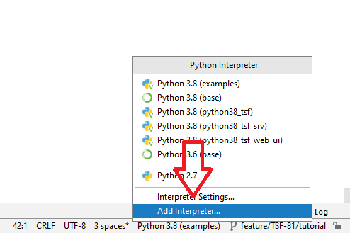

Setup Python
============

This page will guide you through the python setup for ADAS TSF.

Preconditions
-------------
Installed python interpreter (>= 3.6). We need to setup pip to make use of the internal artifactory PYPI mirror.
Please download the https://github-am.geo.conti.de/ADAS-Test-Scripting-Foundation/tsf/blob/develop/utilities/pip.ini and place it to

.. code-block:: console

   %APPDATA%\pip\pip.ini

or any of the other config locations.

Virtual Environment
-------------------

Create a virtual requirement

.. code-block:: console

   cd <path_to_example_repository>
   python -m venv my_venv
   my_venv\Scripts\activate.bat
   pip install -r requirements.txt

the requirements.txt should contain the tsf version you would like to use. For ex.

.. code-block:: console

      adas-tsf==2.2.0
      numpy
      pandas
      plotly

Usage
-----

From the commandline (e.g. cmd, powershell, git bash) make sure to call

.. code-block:: console

   my_venv\Scripts\activate.bat

Before running any of the examples.

When using an IDE you can point the interpret to the venv directly:

      Add interpreter in PyCharm

.. figure:: vs_code_add_interpreter.png
      :align: left
      :figwidth: 100%

      Add interpreter in Visualstudio Code

Code Snippet/Live Template
--------------------------

TSF offers code snippets for both VS Code and PyCharm, the users can use them to configure their IDE.

* VS Code: Follow `create code snippet <https://code.visualstudio.com/docs/editor/userdefinedsnippets#_create-your-own-snippets>`_
  and use the configuration from ``code_snippets\vscode_snippets.json`` to the created configuration file.
* PyCharm: Use the contents of ``code_snippets\pycharm`` to create a zip file,
  use the zip file and follow the steps mentioned in `import live templates <https://www.jetbrains.com/help/pycharm/sharing-live-templates.html#import>`_ to import template.

Use the following prefix to get the template:

  * ^tc: test case
  * ^ts: test step
  * ^cmts: confusion matrix test step
  * ^ptc: parameterized testcase
  * ^sd: signal definition
  * ^csd: compliance signal definition
  * ^sod: sensorics object definition
  * ^asmt: assessment
  * ^event: event
  * ^csr: custom signal reader
  * ^crts: custom report test step
  * ^crtc: custom report test case
  * ^cro: custom report overview
  * ^crs: custom report statistics
  * ^crsr: custom report static page
  * ^preproc: pre-processor class

..
   .. code-block:: ruby
      :linenos:

      Some more Ruby code.